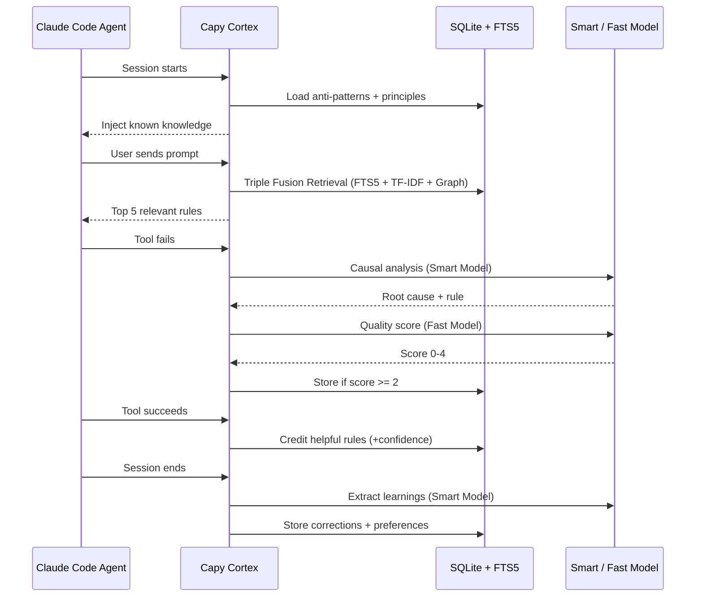
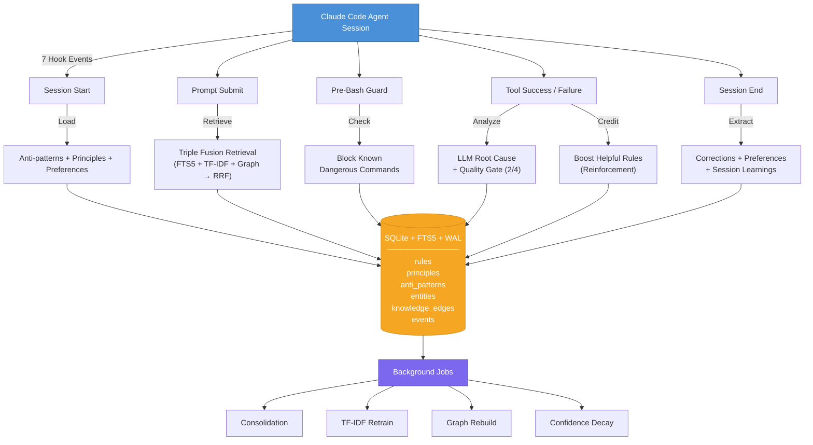
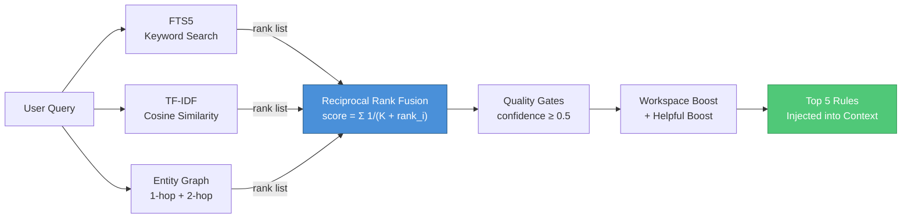

<p align="center">
  <a href="https://happycapy.ai">
    
  </a>
  <br><br>
  <strong>Sponsored by <a href="https://happycapy.ai">HappyCapy</a></strong><br>
  Unlimited 24/7 Claude Code access with Opus 4.6. The agent-native computer for everyone.<br><br>
  <em>Thank you to <a href="https://happycapy.ai">HappyCapy</a> for providing unlimited Claude Code access around the clock with Opus 4.6 -- this project would not exist without their generous support.</em>
</p>

---

<p align="center">
  <h1 align="center">Capy Cortex</h1>
  <p align="center">
    <strong>Autonomous memory and learning system for AI coding agents.</strong><br>
    Your agent makes the same mistake twice. Cortex makes sure there is no third time.
  </p>
</p>

<p align="center">
  <a href="https://github.com/ndpvt-web/capy-cortex/releases/tag/v2.0.0"></a>
  <a href="#license"></a>
  <a href="#"></a>
  <a href="#"></a>
  <a href="#"></a>
  <a href="https://happycapy.ai"></a>
</p>

---

## The Problem

AI coding agents repeat mistakes. They forget what worked. Every session starts from zero.

You fix a deployment bug on Monday. On Wednesday, the same agent hits the same bug and burns 10 minutes rediscovering the fix. Multiply that across hundreds of sessions and you are bleeding hours every week.

**Cortex is the fix.** It gives your agent a persistent, self-curating memory that learns from every session, every error, every correction you make -- and retrieves exactly the right knowledge at exactly the right time.

## How It Works (30-Second Version)



No configuration. No manual tagging. No prompt engineering. Install it and it starts learning.

## Key Capabilities

- **Zero-config learning** -- 7 hooks capture errors, corrections, and preferences automatically
- **LLM-powered extraction** -- Smart model analyzes root causes; fast model scores quality (only stores insights scoring 2+/4)
- **Triple Fusion Retrieval** -- FTS5 full-text + TF-IDF embeddings + Entity Graph, merged via Reciprocal Rank Fusion
- **Self-curating** -- automated deduplication, clustering, principle synthesis, confidence decay
- **Reinforcement loop** -- rules that lead to tool success get boosted; unhelpful rules fade
- **Entity knowledge graph** -- tracks relationships between tools, libraries, errors, and concepts
- **Temporal memory** -- version chains track how knowledge evolves; contradictions are detected and resolved
- **Anti-pattern blocking** -- known dangerous commands are blocked before execution
- **Workspace-aware** -- boosts rules relevant to the current project context
- **Bridge integrations** -- bidirectional sync with Claudeception and Forge multi-agent systems

## Quick Start

### Prerequisites

- Python 3.9+
- `scikit-learn` (for TF-IDF embeddings)
- Access to **any** LLM via a chat completions API (see provider examples below)

### Install

```bash
# Clone into your Claude Code skills directory
git clone https://github.com/ndpvt-web/capy-cortex.git ~/.claude/skills/capy-cortex

# Install Python dependency
pip install scikit-learn

# Initialize the database
python3 ~/.claude/skills/capy-cortex/scripts/setup.py
```

### Configure Your LLM Provider

Cortex is **provider-agnostic**. Set three env vars and you are done. Pick your provider:

<details>
<summary><b>OpenRouter</b> (access Claude, GPT, Gemini, Llama, Grok -- all models, one API)</summary>

```bash
export CORTEX_API_URL="https://openrouter.ai/api/v1"
export CORTEX_API_KEY="sk-or-..."
export CORTEX_SMART_MODEL="anthropic/claude-sonnet-4.6"   # or google/gemini-2.5-pro, openai/gpt-4o
export CORTEX_FAST_MODEL="anthropic/claude-haiku-4.5"     # or google/gemini-2.5-flash, openai/gpt-4o-mini
```
</details>

<details>
<summary><b>OpenAI</b> (GPT-4o, GPT-4o-mini)</summary>

```bash
export CORTEX_API_URL="https://api.openai.com/v1"
export CORTEX_API_KEY="sk-..."
export CORTEX_SMART_MODEL="gpt-4o"
export CORTEX_FAST_MODEL="gpt-4o-mini"
```
</details>

<details>
<summary><b>Google Gemini</b> (via OpenAI-compatible endpoint)</summary>

```bash
export CORTEX_API_URL="https://generativelanguage.googleapis.com/v1beta/openai"
export CORTEX_API_KEY="AIza..."
export CORTEX_SMART_MODEL="gemini-2.5-pro"
export CORTEX_FAST_MODEL="gemini-2.5-flash"
```
</details>

<details>
<summary><b>xAI Grok</b></summary>

```bash
export CORTEX_API_URL="https://api.x.ai/v1"
export CORTEX_API_KEY="xai-..."
export CORTEX_SMART_MODEL="grok-3"
export CORTEX_FAST_MODEL="grok-3-mini"
```
</details>

<details>
<summary><b>Ollama</b> (local, free, no API key needed)</summary>

```bash
export CORTEX_API_URL="http://localhost:11434/v1"
export CORTEX_API_KEY="ollama"
export CORTEX_SMART_MODEL="llama3"
export CORTEX_FAST_MODEL="llama3"
```
</details>

<details>
<summary><b>Together AI / Fireworks / Any OpenAI-compatible endpoint</b></summary>

```bash
export CORTEX_API_URL="https://api.together.xyz/v1"   # or https://api.fireworks.ai/inference/v1
export CORTEX_API_KEY="your-key"
export CORTEX_SMART_MODEL="meta-llama/Llama-3-70b-chat-hf"
export CORTEX_FAST_MODEL="meta-llama/Llama-3-8b-chat-hf"
```
</details>

That is it. The hooks auto-register through the `SKILL.md` manifest. Your agent now has persistent memory.

### Verify It Works

```bash
# Check system status
python3 ~/.claude/skills/capy-cortex/scripts/cortex.py stats

# Should output:
# Rules: 0 active (0 deprecated)
# Principles: 0
# Anti-patterns: 0
# Events: 0
# TF-IDF: not trained (needs 5+ rules)
```

After a few sessions, run it again. You will see rules accumulating.

## Architecture



### The Learning Pipeline

| Stage | What Happens | Model | Latency |
|-------|-------------|-------|---------|
| **Capture** | 7 hooks intercept agent lifecycle events | None | <1ms |
| **Extract** | Causal analysis of failures | CORTEX_SMART_MODEL | ~2s |
| **Gate** | Quality scoring on 4 dimensions | CORTEX_FAST_MODEL | ~500ms |
| **Store** | Deduplicated, topic-classified, graph-linked | None | <5ms |
| **Retrieve** | Triple Fusion: FTS5 + TF-IDF + Graph via RRF | None | <10ms |
| **Credit** | Success reinforcement boosts helpful rules | None | <1ms |
| **Consolidate** | Cluster, merge, synthesize principles | CORTEX_SMART_MODEL | ~30s/batch |

### Quality Gate

Every extracted insight is scored 0-4 on four dimensions before storage:

| Dimension | Question |
|-----------|----------|
| **Actionable** | Can an agent act on this without more context? |
| **Specific** | Does it name concrete tools, files, or commands? |
| **Novel** | Does it teach something not obvious from docs? |
| **Durable** | Will this still be true in 6 months? |

**Threshold: 2/4.** Anything below is discarded. This is why Cortex does not fill up with noise.

### Triple Fusion Retrieval

Three independent signals, fused with Reciprocal Rank Fusion (K=60):



## Project Structure

```
capy-cortex/
  hooks/                    # 7 automatic lifecycle hooks
    on_session_start.py     #   Load anti-patterns, principles, preferences
    on_prompt_submit.py     #   Triple Fusion Retrieval for task-relevant rules
    on_pre_bash.py          #   Block known dangerous commands
    on_pre_write.py         #   Enforce file size limits (Atomic Write Constraint)
    on_tool_success.py      #   Credit rules that led to success
    on_tool_failure.py      #   LLM root cause extraction + quality gate
    on_stop.py              #   Session learnings, corrections, maintenance
  scripts/                  # Core engine + utilities
    cortex.py               #   Core retrieval engine (FTS5 + TF-IDF)
    llm_extract.py          #   LLM extraction with quality gate
    embeddings.py           #   TF-IDF embedding index
    graph_builder.py        #   Entity knowledge graph
    consolidate.py          #   LLM-powered consolidation pipeline
    reflect.py              #   Deep session transcript analysis
    temporal.py             #   Version chains + contradiction detection
    topic_engine.py         #   Fast keyword topic classification
    evaluate.py             #   6-dimension system health evaluation
    bootstrap.py            #   Mine historical session transcripts
    setup.py                #   Database initialization
    bridge_claudeception.py #   Bidirectional Claudeception sync
    bridge_forge.py         #   Bidirectional Forge integration
  dashboard/                # React + TypeScript monitoring dashboard
  SKILL.md                  # Claude Code skill manifest
```

## Evaluation

Cortex evaluates itself across 6 dimensions. After processing 522 sessions:

| Dimension | Score | What It Measures |
|-----------|-------|-----------------|
| **Feedback Loop** | 100.0 | Are surfaced rules credited back on success? |
| **Learning Velocity** | 96.2 | How fast does the system accumulate useful knowledge? |
| **Knowledge Diversity** | 95.0 | Coverage across topics (git, python, docker, react, etc.) |
| **Noise Ratio** | 87.1 | What fraction of stored rules are actually useful? |
| **Retrieval Health** | 84.4 | Are the right rules surfaced for the right queries? |
| **Rule Quality** | 59.1 | Average quality score of the rule corpus |
| **Overall** | **83.6** | Weighted composite |

Rule Quality starts low and improves with use -- the quality gate filters new rules, and consolidation clusters mature rules into higher-quality principles over time.

## Usage

### Automatic (Recommended)

Just use your agent normally. Cortex operates entirely through hooks:

1. **Start a session** -- Cortex loads your top anti-patterns and principles
2. **Send prompts** -- Cortex retrieves relevant rules and injects them as context
3. **Hit errors** -- Cortex analyzes, scores, and stores the insight
4. **Get things right** -- Cortex credits the rules that helped
5. **End the session** -- Cortex extracts corrections and preferences from the transcript

### Manual Commands

```bash
# System health and statistics
python3 scripts/cortex.py stats

# Retrieve rules for a specific topic
python3 scripts/cortex.py retrieve "docker compose networking"

# Add a rule manually
python3 scripts/cortex.py add-rule "Use --network=host for local dev containers" "best_practice"

# Add a critical anti-pattern
python3 scripts/cortex.py add-ap "Never force push to shared branches" "critical"

# Add a user preference
python3 scripts/cortex.py add-pref "Always use TypeScript strict mode"

# Run consolidation (deduplicate, cluster, synthesize principles)
python3 scripts/consolidate.py

# Retrain TF-IDF embeddings after bulk changes
python3 scripts/cortex.py retrain

# Run full evaluation
python3 scripts/evaluate.py

# Bootstrap from historical sessions
python3 scripts/bootstrap.py

# Build/rebuild entity graph
python3 scripts/graph_builder.py build
```

## Database Schema

SQLite with FTS5 full-text search and WAL mode for concurrent reads.

| Table | Purpose | Key Columns |
|-------|---------|-------------|
| `rules` | Learned knowledge | content, category, confidence, quality_score, occurrences, helpful_count |
| `principles` | Consolidated wisdom | content, source_rule_ids, confidence, is_static |
| `anti_patterns` | Critical mistakes | content, severity, confidence |
| `preferences` | User preferences | content, confidence |
| `entities` | Knowledge graph nodes | name, entity_type (tool/library/language/file/command/error/concept) |
| `knowledge_edges` | Graph relationships | source, target, relation_type (causes/fixes/uses/depends_on) |
| `events` | Full audit trail | event_type, rule_id, metadata |
| `extraction_log` | LLM call audit | model, input, output, quality_score, latency_ms |
| `rules_fts` | FTS5 virtual table | Porter stemming + Unicode61 tokenizer |

## When NOT to Use Cortex

Be honest about tradeoffs:

- **Short-lived agents** -- if your agent runs once and is discarded, there is nothing to learn across sessions
- **Deterministic pipelines** -- if your agent follows a fixed script with no errors or variation, memory adds no value
- **Extremely sensitive environments** -- Cortex stores error messages and user corrections in a local SQLite database; if your errors contain secrets, review the data or use encryption
- **Cost-constrained setups** -- the LLM extraction pipeline calls your smart + fast models per error; if you process hundreds of errors per session, API costs add up (use Ollama for free local inference)

## Configuration

Set three environment variables to connect Cortex to **any** LLM provider:

| Environment Variable | Required | Purpose |
|---------------------|----------|---------|
| `CORTEX_API_URL` | **yes** | Your provider's chat completions base URL |
| `CORTEX_API_KEY` | **yes** | API key for your provider |
| `CORTEX_SMART_MODEL` | **yes** | Capable model for causal analysis (e.g. `gpt-4o`, `claude-sonnet-4.6`, `gemini-2.5-pro`) |
| `CORTEX_FAST_MODEL` | **yes** | Fast model for quality scoring (e.g. `gpt-4o-mini`, `claude-haiku-4.5`, `gemini-2.5-flash`) |

Backward-compatible fallbacks: `OPENAI_API_KEY`, `OPENAI_BASE_URL`, `AI_GATEWAY_API_KEY` are also read if `CORTEX_*` vars are not set.

Key constants (in source):

| Constant | Value | File | Purpose |
|----------|-------|------|---------|
| `QUALITY_THRESHOLD` | 2 | llm_extract.py | Minimum quality score to store a rule |
| `DECAY_HALF_LIFE_DAYS` | 90 | cortex.py | Confidence half-life for unreinforced rules |
| `DUPLICATE_THRESHOLD` | 0.85 | consolidate.py | Cosine similarity threshold for dedup |
| `MAINTENANCE_INTERVAL` | 10 | on_stop.py | Sessions between auto-maintenance runs |

## Roadmap

- [ ] MCP server integration for cross-agent memory sharing
- [ ] Vector database backend option (Qdrant/ChromaDB) for large-scale deployments
- [ ] Multi-user knowledge federation
- [ ] Dashboard with real-time learning visualization
- [ ] Export/import for knowledge transfer between environments

## Contributing

Contributions welcome. The codebase is ~5,800 lines of Python across 24 files.

```bash
# Clone and set up
git clone https://github.com/ndpvt-web/capy-cortex.git
cd capy-cortex
pip install scikit-learn
python3 scripts/setup.py

# Run evaluation to verify everything works
python3 scripts/evaluate.py
```

The architecture is modular: hooks are independent, scripts are CLI-callable, and the database schema is self-migrating.

## License

MIT License. See [LICENSE](LICENSE) for details.

---

<p align="center">
  <strong>Built for agents that refuse to make the same mistake twice.</strong><br>
  <sub>If Cortex saved your agent from repeating a bug, consider giving it a star.</sub>
</p>
